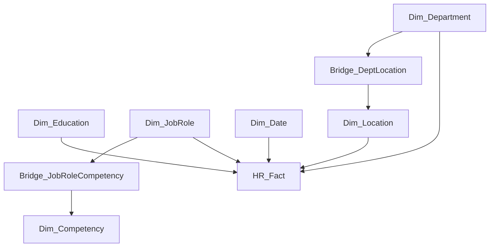

**1. HR_Fact.csv**

| Column                       | Data Description                                                        |
| ---------------------------- | ----------------------------------------------------------------------- |
| `Employee_ID`                | Unique ID of the employee                                               |
| `Department_ID`              | ID of the department where the employee works                           |
| `Location_ID`                | ID of the employee's work location                                      |
| `JobRole_ID`                 | ID of the employee's job role                                           |
| `Age`                        | Age of the employee                                                     |
| `Gender`                     | Gender of the employee                                                  |
| `Education_ID`               | ID of the employee's education level                                    |
| `Years_Experience`           | Total years of work experience                                          |
| `Date_of_Joining`            | Date when the employee joined the company                               |
| `Joining_Date_ID`            | ID used to connect with the Date table                                  |
| `Performance_Rating`         | Employee performance rating                                             |
| `Engagement_Score`           | Employee engagement score                                               |
| `Work_Life_Balance`          | Work-life balance score                                                 |
| `Salary`                     | Employee salary                                                         |
| `Attrition`                  | Indicates whether the employee left the company                         |
| `Absenteeism_Days`           | Number of days the employee was absent                                  |
| `Training_Hours`             | Number of training hours completed                                      |
| `Last_Hike_Percentage`       | Percentage of salary increase in the last hike                          |
| `Promotion_Last_3_Years`     | Indicates whether the employee received a promotion in the last 3 years |
| `Satisfaction_Score`         | Employee satisfaction score                                             |
| `Remote_Work_Percentage`     | Percentage of work performed remotely                                   |
| `Overtime_Hours`             | Number of overtime hours                                                |
| `Last_Review_Date`           | Date of the employee's last performance review                          |
| `Last_Review_Date_ID`        | ID used to connect with the Date table                                  |
| `Tenure_Years`               | Number of years the employee has been with the company                  |
| `Age_Group`                  | Age category of the employee                                            |
| `Performance_Category`       | Performance category                                                    |
| `Salary_Per_Year_Experience` | Salary compared with years of experience                                |
| `Comp_Ratio`                 | Employee salary compared with the expected salary range                 |

**2. Dim_Department.csv**

| Column               | Data Description                                     |
| -------------------- | ---------------------------------------------------- |
| `Department_ID`      | Unique ID of the department                          |
| `Department_Code`    | Code assigned to the department                      |
| `Department_Name`    | Name of the department                               |
| `Department_Head`    | Head of the department                               |
| `Budget_Allocation`  | Budget allocated to the department                   |
| `Cost_Center`        | Cost center assigned to the department               |
| `Establishment_Year` | Year in which the department was established         |
| `Is_Active`          | Indicates whether the department is currently active |

**3. Dim_Location.csv**

| Column          | Data Description                      |
| --------------- | ------------------------------------- |
| `Location_ID`   | Unique ID of the location             |
| `Location_Name` | Name of the location                  |
| `Region`        | Region where the location is situated |
| `Zone`          | Zone of the location                  |
| `Country`       | Country of the location               |
| `City_Type`     | Type/category of the city             |
| `Office_Type`   | Type of company office                |
| `Latitude`      | Latitude of the location              |
| `Longitude`     | Longitude of the location             |

**4. Dim_JobRole.csv**

| Column             | Data Description                 |
| ------------------ | -------------------------------- |
| `JobRole_ID`       | Unique ID of the job role        |
| `JobRole_Name`     | Name of the job role             |
| `Job_Family`       | Job family/category              |
| `Job_Level`        | Level of the job role            |
| `Min_Salary`       | Minimum salary for the role      |
| `Max_Salary`       | Maximum salary for the role      |
| `Target_Bonus_Pct` | Target bonus percentage          |
| `Career_Track`     | Career path or track of the role |

**5. Dim_Education.csv**

| Column               | Data Description                                      |
| -------------------- | ----------------------------------------------------- |
| `Education_ID`       | Unique ID of the education level                      |
| `Education_Level`    | Education level                                       |
| `Years_of_Study`     | Typical number of years of study                      |
| `Typical_Role_Level` | Typical job level associated with the education level |

**6. Dim_Competency.csv**

| Column            | Data Description            |
| ----------------- | --------------------------- |
| `Competency_ID`   | Unique ID of the competency |
| `Competency_Name` | Name of the competency      |

**7. Dim_Date.csv**

| Column           | Data Description                        |
| ---------------- | --------------------------------------- |
| `Date_ID`        | Unique ID for the date                  |
| `Date`           | Actual date                             |
| `Year`           | Year of the date                        |
| `Quarter`        | Quarter number                          |
| `Quarter_Name`   | Quarter name                            |
| `Month`          | Month number                            |
| `Month_Name`     | Full month name                         |
| `Month_Short`    | Short month name                        |
| `Day`            | Day number                              |
| `Day_of_Week`    | Day number within the week              |
| `Day_Name`       | Name of the day                         |
| `Week_of_Year`   | Week number of the year                 |
| `Is_Weekend`     | Indicates whether the date is a weekend |
| `Is_Holiday`     | Indicates whether the date is a holiday |
| `Fiscal_Year`    | Fiscal year                             |
| `Fiscal_Quarter` | Fiscal quarter                          |
| `Month_Year`     | Month and year combination              |
| `Year_Month`     | Year and month combination              |

**8. Bridge_DeptLocation.csv**

| Column          | Data Description                                                          |
| --------------- | ------------------------------------------------------------------------- |
| `Department_ID` | ID of the department                                                      |
| `Location_ID`   | ID of the location                                                        |
| `Is_Primary`    | Indicates whether the location is the primary location for the department |

**9. Bridge_JobRoleCompetency.csv**

| Column          | Data Description                                     |
| --------------- | ---------------------------------------------------- |
| `JobRole_ID`    | ID of the job role                                   |
| `Competency_ID` | ID of the competency                                 |
| `Weight`        | Importance/weight of the competency for the job role |

**Create Relationships Between Tables**

| From Table               | Column              | To Table                 | Column        |
| ------------------------ | ------------------- | ------------------------ | ------------- |
| HR_Fact                  | Department_ID       | Dim_Department           | Department_ID |
| HR_Fact                  | Location_ID         | Dim_Location             | Location_ID   |
| HR_Fact                  | JobRole_ID          | Dim_JobRole              | JobRole_ID    |
| HR_Fact                  | Education_ID        | Dim_Education            | Education_ID  |
| HR_Fact                  | Joining_Date_ID     | Dim_Date                 | Date_ID       |
| HR_Fact                  | Last_Review_Date_ID | Dim_Date                 | Date_ID       |
| Dim_JobRole              | JobRole_ID          | Bridge_JobRoleCompetency | JobRole_ID    |
| Bridge_JobRoleCompetency | Competency_ID       | Dim_Competency           | Competency_ID |
| Dim_Department           | Department_ID       | Bridge_DeptLocation      | Department_ID |
| Bridge_DeptLocation      | Location_ID         | Dim_Location             | Location_ID   |

# Define Cardinality

Cardinality tells us how many records from one table can be related to records in another table. 

In Power BI, the main cardinality options are:
One-to-many (1:*) 
Many-to-one (*:1) 
One-to-one (1:1) 
Many-to-many (:) 

| Relationship                              | Cardinality |
| ----------------------------------------- | ----------- |
| Dim_Department → HR_Fact                  | 1 : *       |
| Dim_Location → HR_Fact                    | 1 : *       |
| Dim_JobRole → HR_Fact                     | 1 : *       |
| Dim_Education → HR_Fact                   | 1 : *       |
| Dim_Date → HR_Fact                        | 1 : *       |
| Dim_JobRole → Bridge_JobRoleCompetency    | 1 : *       |
| Dim_Competency → Bridge_JobRoleCompetency | 1 : *       |
| Dim_Department → Bridge_DeptLocation      | 1 : *       |
| Dim_Location → Bridge_DeptLocation        | 1 : *       |

# Configure Cross-Filter Direction

Cross-filter direction tells Power BI: In which direction should filtering travel between the related tables? 

There are two main options: 
Single 
Both 

# 4) Manage Relationships in Model View

In Power BI: 
Model View → Manage relationships 

Here we can: 
Create relationships 
Edit relationships 
Delete relationships 
Change cardinality 
Change cross-filter direction 
Activate/deactivate relationships 

| File Name                      | Table Type      | Main Purpose                        |
| ------------------------------ | --------------- | ----------------------------------- |
| `HR_Fact.csv`                  | Fact Table      | Employee/business records           |
| `Dim_Department.csv`           | Dimension Table | Department information              |
| `Dim_Location.csv`             | Dimension Table | Location information                |
| `Dim_JobRole.csv`              | Dimension Table | Job role information                |
| `Dim_Education.csv`            | Dimension Table | Education information               |
| `Dim_Competency.csv`           | Dimension Table | Competency information              |
| `Dim_Date.csv`                 | Dimension Table | Date/time information               |
| `Bridge_DeptLocation.csv`      | Bridge Table    | Connects departments and locations  |
| `Bridge_JobRoleCompetency.csv` | Bridge Table    | Connects job roles and competencies |

